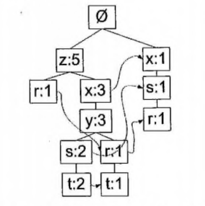

# FP-growth

用于高效发现频繁集

## 基本过程

两遍扫描
1. 构建 FP 树
2. 从 FP 树中挖掘频繁项集

## FP Tree

FP - Frequent Pattern, FP 树用于储存`项集`的出现频率，`项集`以路径的方式存储。
每个节点存储集合中的单个元素及其总出现次数。

### FP 树的构建
1. 筛选频繁元素
2. 遍历所有项集，对每条项集进行排序后选取频繁序列
3. 将第 2 步选取的频繁序列自定向下插入 FP 树

